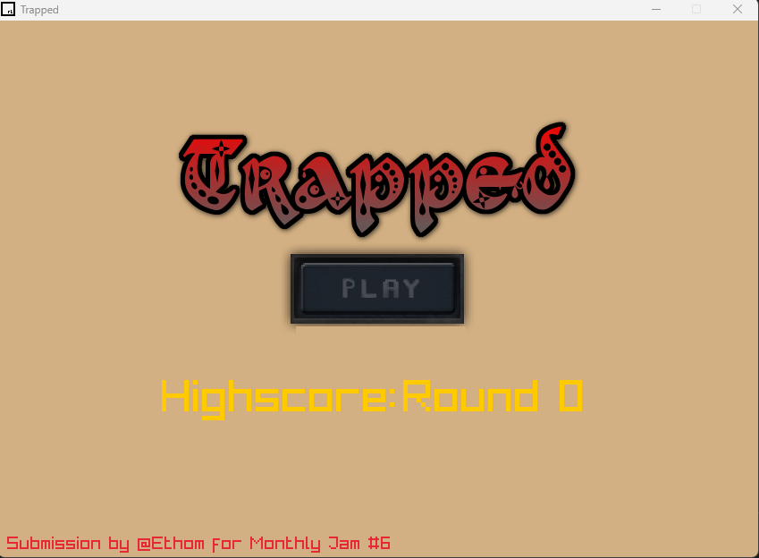
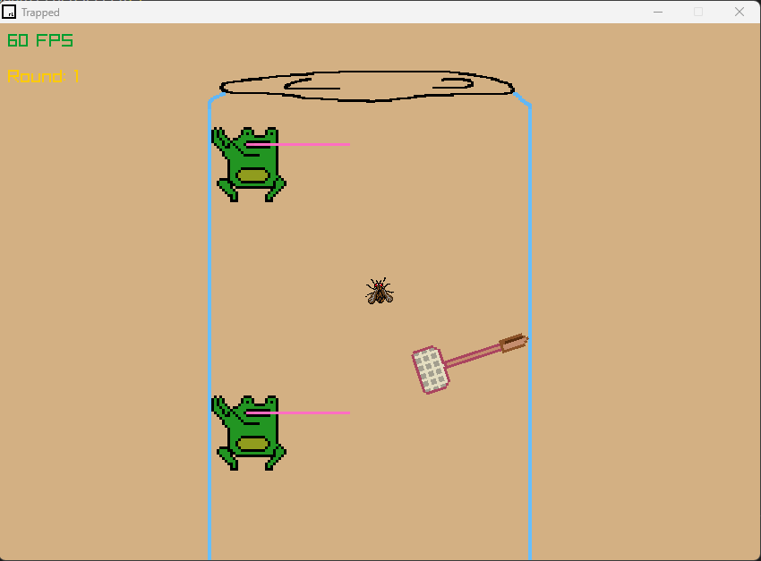

# Trapped

## Description:

Trapped is a 2D survival created without the use of a conventional game engine. 

The game was made in 5 days as a submission to  @serci98's Monthly GameJam #6 on itch.io (you can find the gamejam linked below).

The game was programmed with C/C++ using the Raylib library, OpenGL, and my own personalized library for extra functionality.

All assets/artwork were created by me using libresprite.

Currently majority of production on the game has been finalized with minor updates from time to time.

**The game includes:**
- Surviving waves of enemies
- Maneuvering through obstacles to reach the top of the jar
- 3 types of enemies
- Complete randomness
- Stored HighScores

## Controls:
- Close = ESC
- Forwards = 🡅 / W 
- Backwards = 🡇 / S
- Rotate Left = 🡄 / A 
- Rotate Right = 🡆 / D 

## How to Access (Currently only accessible on windows):
**Through Itch.io**

Link: https://ethanrce.itch.io/trapped
1. Navigate to the website and click Download Now.
2. Unzip/Extract all files into a folder.
3. Run the "Trapped.exe" application.

**Through GitHub:**

Navigate to the link.

Link: https://github.com/ethanrce/Trapped/releases/tag/1.0
